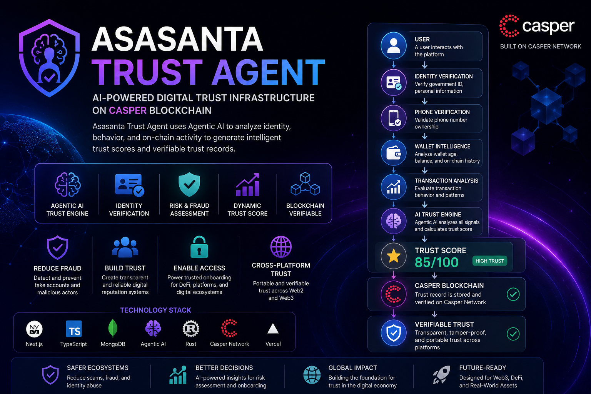

  

 # 🧠 Asasanta Trust Agent Infrastructure on casper Blockchain

## 🚀 Overview

Asasanta Trust Agent is an AI-powered trust infrastructure designed to solve identity fraud, fake digital records, and the lack of transparent reputation systems.

The platform combines reusable AI Skills with the Pharos blockchain to analyze digital trust, detect fraud, calculate trust scores, generate immutable on-chain trust proofs, and issue publicly verifiable digital trust certificates.

Asasanta Trust Agent is built as a composable AI Trust Agent, where individual Skills can be integrated into other AI Agents, applications, and decentralized ecosystems.

---

# ❗ Problem

Millions of people and organizations struggle with digital trust challenges:

* Identity fraud and impersonation
* Fake digital records and credentials
* Lack of reliable reputation systems
* Limited access to trusted financial services
* Centralized databases that can be manipulated or difficult to verify

Traditional trust systems are often controlled by centralized institutions, making transparency, portability, and global verification difficult.

---

# 💡 Solution

Asasanta Nexus introduces an intelligent AI Trust Agent that:

* Verifies digital identities
* Calculates AI-powered trust scores
* Detects suspicious behavior and fraud risks
* Makes autonomous trust decisions
* Generates blockchain trust proofs
* Issues verifiable digital trust certificates
* Enables public trust verification through QR codes

---

# 🧩 Reusable AI Skills

The Asasanta Nexus AI Agent is built using independent reusable Skills that can be called by other AI Agents or applications.

## 🪪 Identity Verification Skill

Input:

* User identity information

Output:

* Verification status
* Identity confidence score
* Risk assessment

---

## 📊 Trust Score AI Skill

Input:

* Identity data
* Behavioral indicators
* Risk signals

Output:

* AI-generated trust score from 0–100

---

## 🚨 Fraud Detection Skill

Input:

* User activity and security signals

Output:

* Fraud risk analysis
* Suspicious activity detection

---

## 🤖 AI Decision Skill

Combines all AI results and produces a final decision:

* Approved
* Review Required
* Rejected

---

## 🔗 Pharos Trust Proof Skill

Creates immutable blockchain trust records.

Input:

* AI trust result
* Trust score
* Verification metadata

Output:

* On-chain proof
* Transaction hash
* Blockchain verification record

---

# 🧠 AI Agent Architecture

User

↓

Identity Verification Skill

↓

Trust Score AI Skill

↓

Fraud Detection Skill

↓

AI Decision Engine

↓

Pharos Trust Proof Skill

↓

Pharos Blockchain Layer

↓

Digital Trust Certificate

↓

Public Verification Portal

---

# ⚙️ Core Features

## 🤖 AI Trust Analysis

An intelligent AI engine that evaluates user trust and produces transparent verification decisions.

---

## 🔐 Pharos Blockchain Integration

The system integrates with Pharos to:

* Store AI trust proofs on-chain
* Generate blockchain transaction records
* Create transparent and immutable verification history

---

## 🪪 Digital Trust Certificate

Each successful verification generates:

* Unique Certificate ID
* Trust Score
* AI Decision
* Blockchain transaction reference
* QR-based verification link

---

## 🌐 Public Verification Portal

Anyone can verify a certificate through a public verification page.

Example:

/verify/CERT-ASASANTA001-123456

---

# 🛠 Technology Stack

## Frontend

* Next.js
* TypeScript
* Tailwind CSS

## Backend

* Next.js API Routes
* TypeScript

## AI Layer

* Google Gemini AI
* Identity Verification Engine
* Trust Score Engine
* Fraud Detection Engine
* AI Agent Controller

## Blockchain Layer

* Pharos Atlantic Testnet
* Solidity Smart Contracts
* MetaMask Wallet Integration
* On-chain Trust Proof Storage

## Database

* MongoDB

---

# 📦 Installation

Clone the repository:

git clone https://github.com/ASASANTA360/asasanta-nexus-app-v2.git

Install dependencies:

npm install

Run the development server:

npm run dev

Open:

http://localhost:3000

---

# 🎬 Demo Workflow

1. User connects a wallet to Pharos.
2. AI Agent performs trust analysis.
3. AI Skills generate trust score and fraud assessment.
4. AI Decision Engine produces a final trust decision.
5. Trust Proof Skill stores verification data on Pharos.
6. A digital trust certificate is generated.
7. Anyone can verify the certificate using a QR code.

---

# 🌍 Real-World Use Cases

* Digital identity verification
* AI Agent reputation systems
* Web3 trust infrastructure
* Financial inclusion
* Online marketplace reputation
* Decentralized credential verification

---

# 🔮 Future Development

* Decentralized Identity (DID) support
* AI Agent reputation profiles
* Cross-chain trust verification
* Enterprise APIs and SDKs
* AI-to-AI trust interoperability

---

# 🏆 Hackathon Vision

Asasanta Nexus aims to become the trust infrastructure layer for AI Agents, digital identity, RealFi, and the future of decentralized economies.

By combining autonomous AI decision-making with transparent blockchain verification, Asasanta Nexus enables safer digital interactions and verifiable online reputation.

---

## 🚀 Built for the Pharos Skill-to-Agent Dual Cascade Hackathon

Created by **Asasanta Global Technologies**
